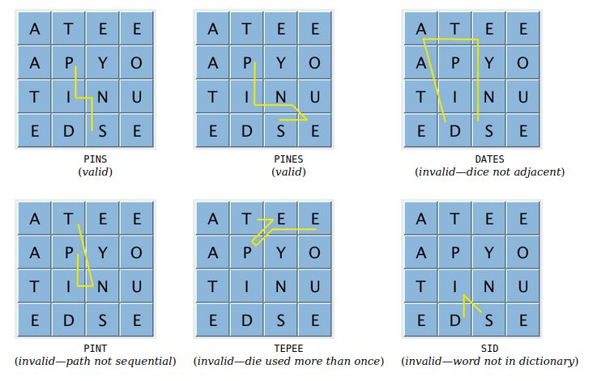

# Boggle - solve Boggle boards with tries


## Details 
Solves Boggle boards with a dictionaries and automatically generated tries



See https://coursera.cs.princeton.edu/algs4/assignments/boggle/specification.php

```
ASSESSMENT SUMMARY


Compilation:  PASSED
API:          PASSED

SpotBugs:     PASSED
PMD:          FAILED (2 warnings) [false positives]
Checkstyle:   PASSED

Correctness:  13/13 tests passed
Memory:       3/3 tests passed
Timing:       9/9 tests passed

Aggregate score: 100.00%
[ Compilation: 5%, API: 5%, Style: 0%, Correctness: 60%, Timing: 10%, Memory: 20% ]
```

```
Test 2: timing getAllValidWords() for 5.0 seconds using dictionary-yawl.txt
        (must be <= 2x reference solution)
    - reference solution calls per second: 6759.83
    - student   solution calls per second: 10778.87
    - reference / student ratio:           0.63

=> passed    student <= 10000x reference
=> passed    student <=    25x reference
=> passed    student <=    10x reference
=> passed    student <=     5x reference
=> passed    student <=     2x reference
```
